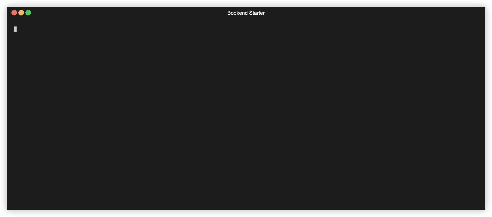
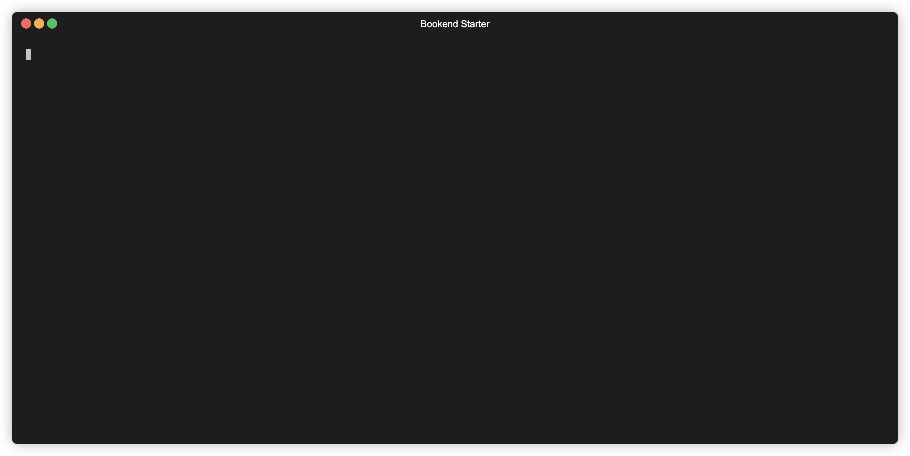

# 🚀 Bookend: Spring Native Starter app

- Example Spring Boot REST application using Spring Native
- Spring Boot, Java 11, Lombok

Provided a comparison between JVM image build and GraalVM image build.

**Using Spring Native** :hourglass_flowing_sand: `0.067 seconds`


**Using the JVM** :hourglass_flowing_sand: `2.112 seconds`



## Get started

```shell
./mvnw clean spring-boot:build-image
```

